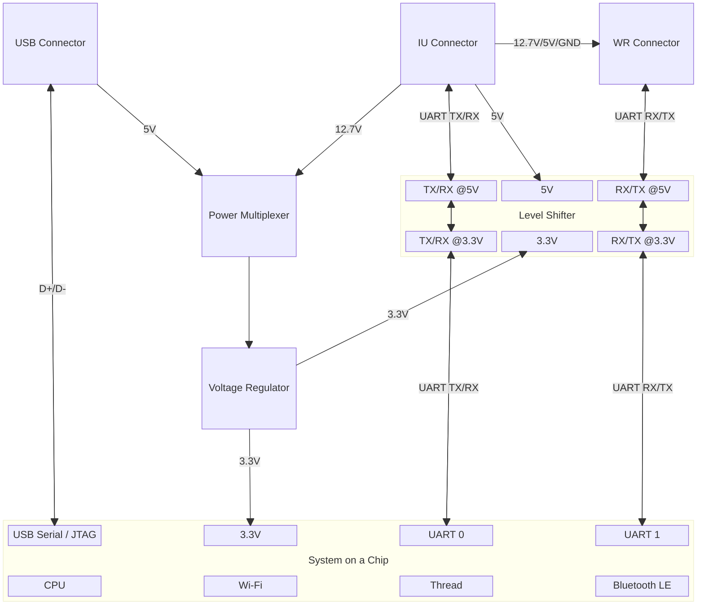
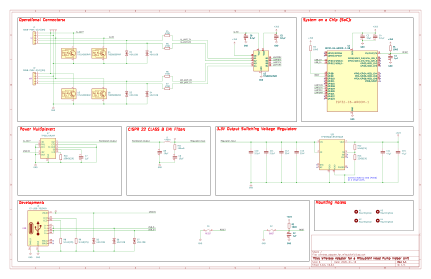
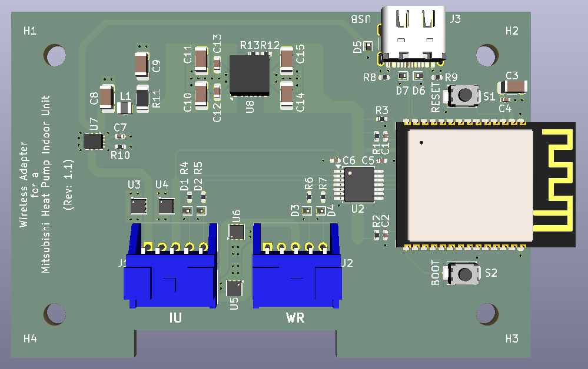

# Wireless Adapter Hardware

I designed the wireless adapter hardware to meet [these requirements](./requirements.md).

The current design is the same circuit design and PCB layout as the design I had fabricated except

- I changed the value of capacitor C2 from 1μF to 0.1μF,
- I removed instances of different signals sharing one ground via from the PCB,
- I removed the wall mounting passthrough hole from the PCB,
- I added the name and revision to the PCB,
- I switched from a hierarchical schematic to a flat schematic, and
- I updated from KiCad 9.0.x to KiCad 10.0.x.

## Architecture

The high level block diagram below shows basic functions of the wireless adapter.

The [USB connector](./hardware/development.md#usb-connector) (along with the [reset and boot switches](./hardware/development.md#switches)) eases development.

The [IU connector](./hardware/connectors.md#the-wireless-adapters-iu-connector) and [WR connector](./hardware/connectors.md#the-wireless-adapters-wr-connector) connect to the indoor unit of a Mitsubishi Electric heat pump and the wireless receiver of a Mitsubishi Electric controller kit respectively

The [power multiplexer](./hardware/power.md#power-multiplexer) switches between the 5V power provided through the USB connector and the 12.7V power provided through the IU connector, with priority given to the IU connector's 12.7V power when present. This allows the USB connector to power the System on a Chip (SoC) during development.

The [voltage regulator](./hardware/power.md#33v-output-switching-voltage-regulator) converts the power from the output of the power multiplexer to the 3.3V needed to power the SoC as well as power the SoC side of the level shifter.

The [level shifter](./hardware/connectors.md#level-shifter) converts the UART signals between the 3.3V signals expected by the SoC and the 5V signals expected by the indoor unit (connected via the IU connector) and the wireless receiver (connected via the WR connector).

The SoC provides the Wi-Fi, Thread and Bluetooth LE interfaces to the indoor unit and the wireless receiver.

# Fabrication and Assembly

This is the first time that I have had a PCBA fabricated and assembled.

I chose [JLCPCB](https://jlcpcb.com) because they are a inexpensive, one-stop shop. They

- provide [parts](https://jlcpcb.com/parts),
- provide [PCB fabrication](https://jlcpcb.com/pcb-fabrication/fr4-pcb),
- provide [PCB assembly](https://jlcpcb.com/pcb-assembly),
- are reasonably priced, and
- are reasonably fast.

Because I chose JLCPCB, I made sure the parts I used are available from [JLCPCB parts](https://hlcpcb.com/parts). When possible, I chose resistors, capacitors and diodes that were available as basic or promotional extended parts because they are cheaper during PCB assembly. In addition, I chose parts that support surface mounted technology (SMT) rather than through hole technology (THT) because they are cheaper during assembly. The one exception is the JST S05B-PASK-2(LF)(SN) connector used for the IU connector and WR connector because through hole connectors tend to be more securely attached than surface mount connectors.

I made two versions of the PCBA. The first version was the test version. The second version was the "production" version. The first version worked but the USB-C connector was poorly placed. The second version was similar to the first version except the switches and ESD diodes were replaced with basic or promotional extended parts, the LEDs were removed, and the layout was changed.

## The Completed Design

### The Parts List

 The PCBA contains the parts

- System on a Chip: [Espressif ESP32-C6-WROOM-1-N8](./hardware/soc.md) (U1)
- Level Shifter: [Texas Instruments TXS0104EPW](./hardware/connectors.md#level-shifter) (U2)
- Power Multiplexer: [Texas Instruments TPS2121RUX](./hardware/power.md#power-multiplexer) (U7)
- Power Module: [Texas Instruments TPSM5601R5HRDA](./hardware/power.md#33v-output-switching-voltage-regulator) (U8)
- TVS Devices: [Texas Instruments TVS1400DRV](./hardware/connectors.md#power-pin-voltage-surge-protection) (U3, U5) and [Texas Instruments TVS0500DRV](./hardware/connectors.md#power-pin-voltage-surge-protection) (U4, U6)
- ESD Diodes: [R+O H5VL10B](./hardware/connectors.md#signal-pin-voltage-surge-protection) (D1-D7)
- USB Connector: [G-Switch GT-USB-7010ASV](./hardware/development.md#usb-connector) (J3)
- IU Connector: [JST S05B-PASK-2](./hardware/connectors.md#connectors) (J1)
- WR Connector: [JST S05B-PASK-2](./hardware/connectors.md#connectors) (J2)
- Switches: [XunPu TS-1088-AR02016](./hardware/development.md#switches) (S1, S2)
- Capacitors: [Samsung Electro-Mechanics capacitors](./hardware/passive.md#capacitors) (C1-C15)
- Resistors: [Uni-royal thick film 0402/0603/0805/1206/1210/1812/2010/2512 series resistors](./hardware/passive.md#resistors) (R1-R13)
- Inductor: [Murata DFE201610E-R47M=P2 inductor](./hardware/passive.md#inductors) (L1)

When selecting parts, I selected

- Espressif parts because I am familiar Espressif's development tools,
- Texas Instruments parts because I am familiar with Texas Instruments' design documentation and tools, and
- JLCPCB basic and promotional extended parts because they are less expensive during assembly.

### The Schematic

### The PCBA

The completed PCBA is a two-layer, rigid PCBA. The bottom layer contains a ground plane. The top layer contains ground pours, the power pours, the power traces, the signal traces and the parts.