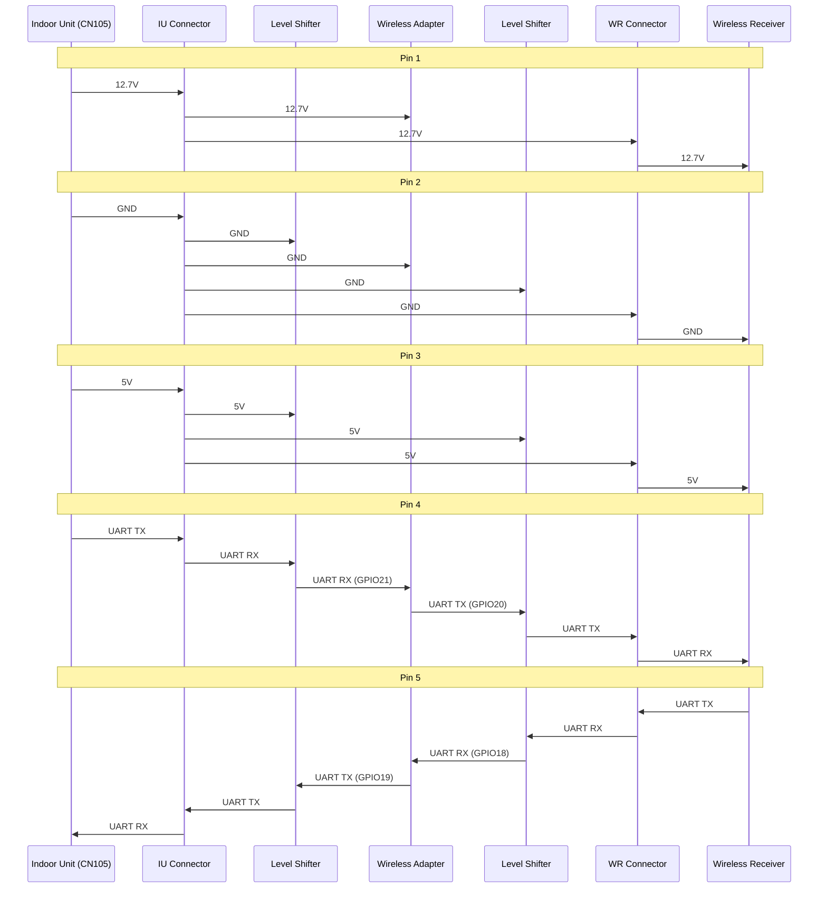

# Operational Connectors

## Connectors

The wireless adapter has two operational connectors

- the IU connector and
- the WR connector.

The IU connector connects the wireless adapter to the Mitsubishi Electric heat pump's indoor unit. The WR connector connects the wireless adapter to the Mitsubishi Electric MIFH1/MIFH2 wireless receiver. So, there are four connectors involved

- the indoor unit's CN105 connector, and
- the wireless adapter's WR connector.
- the wireless adapter's IU connector, and
- the wireless receiver's cable connector.

These connectors can be divided into two classes

- Output connectors:
    - the indoor unit's CN105 connector, and
    - the wireless adapter's WR connector.
- Input connectors:
    - the wireless adapter's IU connector, and
    - wireless receiver's cable connector.

where output connectors source power and input connectors sync power.

Because the indoor unit's CN105 connector is a 5-pin, male, [JST PA family](https://www.jst-mfg.com/product/pdf/eng/ePA-F.pdf) connectors, all four connectors are 5-pin [JST PA family](https://www.jst-mfg.com/product/pdf/eng/ePA-F.pdf) connectors.

All four connectors have the same pinout except for the pin direction

| Pin Number | Pin Function | Indoor Unit  | IU    | WR     | Wireless Receiver
| ---------- | ------------ | ------------ | ----- | ------ | -----------------
| 1          | 12.7V        | Output       | Input | Output | Input
| 2          | GND          | Output       | Input | Output | Input
| 3          | 5V           | Output       | Input | Output | Input
| 4          | UART         | TX           | RX    | TX     | RX
| 5          | UART         | RX           | TX    | RX     | TX

### The Wireless Adapter's IU Connector

I chose the [JST S05B-PASK-2(LF)(SN)](https://www.jst-mfg.com/product/pdf/eng/ePA-F.pdf) connector because it's a through hole device rather than a surface mount device. In general, through hole devices attach more securely than surface mount devices, which can be important with connectors.

A cable with a [JST PAP-05V-S](https://www.jst-mfg.com/product/pdf/eng/ePA-F.pdf) housing at each end connects between the indoor unit's CN105 connector and the wireless adapter's IU connector.

Essentially, the wireless adapter's IU connector along with the cable looks like the MIFH1/MIFH2 wireless receiver's cable connector to the indoor unit.

### The Wireless Adapter's WR Connector

I chose the [JST S05B-PASK-2(LF)(SN)](https://www.jst-mfg.com/product/pdf/eng/ePA-F.pdf) connector because it's a through hole device rather than a surface mount device. In general, through hole devices attach more securely than surface mount devices, which can be important with connectors.

Essentially, the wireless adapter's WR connector looks like the indoor unit's CN105 connector to the MIFH1/MIFH2 wireless receiver's cable connector.

## Connectivity

This diagram shows the connectivity. The IU connector and WR connector are part of the wireless adapter but are shown as separate because it is helpful in showing the difference between how the power pins (12.7V, GND and 5V) and signal pins (UART TX and UART RX) are routed. The level shifter is part of the wireless adapter but is shown as separate because it is helpful in showing the powering of and signal flow through the level shifter.

## Power Pins

The 12.7V, GND and 5V are wired directly from the indoor unit to the wireless receiver. In addition, they are wired directly from the indoor unit to the wireless adapter. In particular, the 5V powers the level shifter's 5V rail, and the 12.7V powers the rest of the wireless adapter.

### Power Pin Voltage Surge Protection

Because of this direct wiring, voltage surges on a WR connector's power pin can travel to the IR connector's corresponding power pin and damage the indoor unit. Likewise, voltage surges on the IR connector's power pin can travel to the corresponding WR connector's power pin and damage the wireless receiver. Therefore, it's important to maximize protection against voltage surges on the power pins. So, I chose the most conservative surge protection devices I could find, which are the [Texas Instruments flat-clamp surge protection devices](https://www.ti.com/lit/wp/slyy127/slyy127.pdf). The 12.7V power pins on the IU and WR connectors rely on the [Texas Instruments TVS1400](https://www.ti.com/product/TVS1400) to clamp the voltage below 19.3V. The 5V pins on the IU and WR connectors rely on the [Texas Instruments TVS0500](https://www.ti.com/product/TVS0500) to clamp the voltage below 9.5V.

### Power Trace Protection

The JST PA family of connectors support up to 3A per pin. In addition, [it appears that at least some indoor units](https://cuttlefishblacknet.wordpress.com/2019/05/) have a 3A fuse on the 12.7V power supply. While I don't expect the indoor unit will supply 3A or the wireless receiver will draw 3A, I have found nothing to show that they couldn't. Therefore, I chose 1.2mm wide power traces between the IU and WR connectors. This results in a 12.5&deg;C temperature rise at 3A. Wider traces would have resulted in a lower temperature rise but would have resulted in a less compact layout for a situation that is unlikely to occur.

## Signal Pins

The indoor unit's UART signals are wired to the wireless adapter, and the wireless receiver's UART signals are wired to the wireless adapter. This allows the wireless adapter to manipulate the indoor unit's and wireless receiver's UART signals. Essentially, the wireless adapter acts as a man-in-the-middle.

### Level Shifter

For their UART signaling, the indoor unit and the wireless receiver use 5V logic. However, the [SoC](./soc.md) uses 3.3V logic. As a result, for the UART signals to be most reliable, the wireless adapter needs a level shifter to convert between the 5V logic and the 3.3V logic.

There are many different level shifters both discrete and integrated. I chose the [Texas Instruments TXS0104EPW](https://www.ti.com/product/TXS0104E) because

- it doesn't require sequencing of the two power rails, which makes it possible to apply the 3.3V rail when there is no 5V rail,
- it has auto-direction support, which simplifies routing, and
- it has a wide package, which makes it possible to run power and signal traces under the package.

Not requiring sequencing of the two power rails means that the 5V rail can be floating while the 3.3V rail is powered, which is what happens when doing development while the wireless adapter is disconnected from the indoor unit. Not requiring sequencing of the two power rails means that the 5V rail can be powered just before the 3.3V rail, which is what happens when the wireless adapter is connected to the indoor unit and the indoor unit is powered up.

The simplified routing afforded by the auto-direction support and the wide package made it possible to use a 2-layer PCB with the top layer being power and signalling and the bottom layer being a ground plane.

### Signal Pin Voltage Surge Protection

I chose to protect the UART RX and UART TX signal pins with traditional 5V bi-direction ESD protection diodes. Specifically, I chose [R+O H5VL10B](https://www.lcsc.com/datasheet/C7420372.pdf) ESD protection diodes. I chose these ESD protection diodes because

- the signal pins do not require the same protection as the power pins because the signal pins don't connect to another connector from which they might pick up a power surge,
- the diode is equivalent to the one used to protect the Espressif's [ESP32-C6-DevKitC-1](https://dl.espressif.com/dl/schematics/esp32-c6-devkitc-1-schematics_v1.4.pdf)'s USB-C VBUS, D+ and D- pins,
- the diode relatively small,
- the diode is available as a promotional extended part from JLCPCB so they are cheaper during PCB assembly.

### Series Resistor

There are two potential problems that can be addressed by putting a series resister between the level shifter and the connector.

First, it's possible to connect the indoor unit's connector to the WR connector and to connect the wireless receiver's connector to the IU connector. If this happens, then a the indoor unit's UART TX signal will be connected to a WR connector's UART TX signal and the wireless receiver's UART TX will be connected to the IU connector's UART TX signal. This can result in excessive current draw. This excessive current can be reduced or eliminated by adding an appropriately valued series resister n the UART signal line between the level shifter and the connector.

Second, the long cables from the indoor unit and the wireless receiver can result in signal ringing on signal edge transitions. This may be made worse by the level shifter as it contains circuitry to sharpen signal edge transitions. This ringing can be reduced or eliminated by adding an appropriately valued series resistor on the UART signal line between the level shifter and the connector.

I chose a 470&ohm; resister. This limits the current to ~10mA. I don't know whether the value is reasonable for reducing/eliminating ringing without slowing the transition too much.
